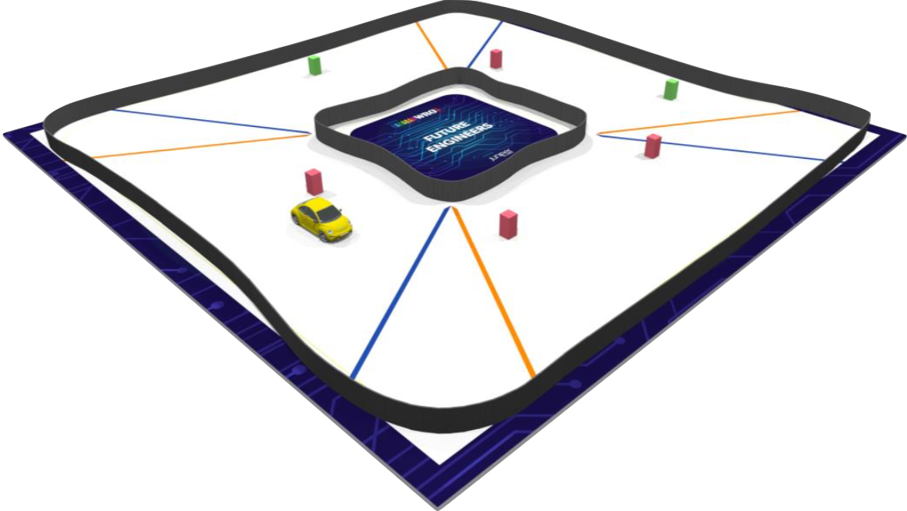

# RoboKings - WRO Future Engineers 2024: Autonomous Self Driving Car
## Team
RoboKings (Pakistan)

### Member Details :
- Moeez Anwar (**Software Developer**)
- Fateh Zeeshan (**Hardware Developer**)
- Hamza Alam (**Software Developer**)

## Project Overview
We're the RoboKings, a passionate team from Pakistan on a mission to conquer the WRO Future Engineers 2024 challenge by building a fully autonomous self-driving car! Inspired by the magic of Santa's industrious elves, our car is designed to navigate a designated track and complete three laps without human intervention. This project embodies our commitment to robotics, innovation, and the future of intelligent transportation.

### The WRO Challenge and Our Focus
The WRO Future Engineers category emphasizes the entire engineering process. Teams earn points for their final product and for documenting their journey within a public GitHub repository. This year's exciting challenge features a randomly changing track, testing our car's adaptability!

We're focusing on these key areas to build our autonomous car:

- **Sensor Fusion and Computer Vision:** We'll use LiDAR, cameras, and computer vision to give our car a real-time understanding of its surroundings.
- **Open-Source Hardware:** We're building with readily available components like a Jetson Nano, an RC chassis, and the Adafruit Motor Shield.
- **Action Planning and Kinematic Control:** Sophisticated algorithms will enable the car to make decisions and execute maneuvers beyond simple differential drive.
- **Optimization for Stability:** Our goal is to create a consistently reliable car capable of navigating the various track layouts.
- **Teamwork and Documentation:** Strong collaboration, communication, and a detailed engineering journal will be critical to our success.
## Track Details :


## Technical Specifications

### Hardware

| Component | Description | Image | Link 
|---|---|---|---|
| **NVIDIA Jetson Nano** | Provides processing power for complex deep learning models. |  | <https://bit.ly/3wKg5TG>
| **LiDAR Sensor** | Creates a detailed 3D map of the environment for precise navigation and obstacle detection. |  |<https://amzn.to/3SXeS2I>
| **2-3 Raspberry Pi Cameras** | Capture rich visual data used for object detection, lane tracking, and path planning. |  |<https://amzn.to/4c0Tv9o>
| **RC Car Chassis** | The physical foundation for our self-driving elf car. | |<https://amzn.to/3uPM0Bz>
| **Adafruit Motor Shield** | Enables precise motor control for smooth and reliable movements and steering. |  |<https://bit.ly/4a2cHle>

### Software
- **C++:** Forms the core of our development, allowing for efficient code and optimal performance.
- **Open-Source Libraries:** We'll utilize established deep learning libraries like TensorFlow or PyTorch for training our autonomous driving model, plus libraries for sensor integration and motor control.

## Project Structure
- **Documentation:** Comprehensive guides on project goals, hardware setup, software design, the WRO challenge, our engineering journey, and more!
- **Code:** Well-structured C++ code with clear modularity, informative comments, and adherence to best practices.
- **Data:** Curated training data for the deep learning model.
- **3D Design Files (Optional):** Files used for customized parts or modifications.

## Collaboration, Contribution, and Community
The RoboKings welcome collaboration! Reach out to us through discussions, pull requests, or issues to share your expertise, suggest improvements, or report any challenges you encounter. We're excited to be part of the WRO community and are committed to sharing our progress and lessons learned.

**Disclaimer:**  We may not be able to disclose certain implementation details related to our deep learning model or proprietary algorithms to safeguard our competitive edge.

## Installation 
### Vscode & C++ Installation: 
**Installing Visual Studio Code**

Since the Jetson Nano has an ARM-based architecture, you'll need to get VS Code in a few different ways:

1. **Remote Development:**
   * This is the recommended approach for complex development.  Install VS Code on a more powerful desktop computer (Windows, macOS, or Linux).
   * On your Jetson Nano, install the Remote Development extensions for VS Code: [https://marketplace.visualstudio.com/items?itemName=ms-vscode-remote.vscode-remote-extensionpack](https://marketplace.visualstudio.com/items?itemName=ms-vscode-remote.vscode-remote-extensionpack)
   * Connect to your Jetson Nano from your desktop VS Code for a seamless development experience.

2. **Install VS Code Server (Less Recommended):**
    * You can install a lightweight version of VS Code that runs directly on the Jetson Nano   

**Setting Up for C++ Development**

1. **Install C/C++ Extension:** Follow the same instructions as the general guide.

2. **Install a C++ Compiler:**
   * Use Ubuntu's package manager:
     ```bash
     sudo apt-get install g++
     ```

**Testing Your Setup:**

* Follow the same steps as the general guide for creating a test C++ file, compiling, and running it.

**Additional Considerations for Jetson Nano**

* **Performance:** The Jetson Nano has limited resources compared to a desktop. You might experience some limitations in terms of speed for large projects.
* **Cross-Compilation:** If you prefer working on a desktop PC, you can set up cross-compilation to build code specifically targeting the Jetson Nano's ARM architecture.

### ROS installation guide for NVIDIA jetson :

**Prerequisites**

* **Operating System:** Ubuntu 18.04 (Bionic Beaver) or Ubuntu 20.04 (Focal Fossa). Check your OS version using `lsb_release -a`.
* **NVIDIA Hardware:** A compatible NVIDIA device (e.g., Jetson Nano, Jetson Xavier NX, etc.).
* **NVIDIA JetPack:** If you're using a Jetson device, ensure you have JetPack installed appropriately for your hardware.

**Installation Steps**

1. **Set Up Sources**

   * Configure your Ubuntu repositories to allow "restricted," "universe," and "multiverse."
   * Add the ROS repository:

     ```bash
     sudo apt-key adv --keyserver 'hkp://keyserver.ubuntu.com:80' --recv-key C1CF6E31E6BADE8868B172B4F42ED6FBAB17C654
     sudo sh -c 'echo "deb http://packages.ros.org/ros/ubuntu $(lsb_release -sc) main" > /etc/apt/sources.list.d/ros-latest.list'
     ```

2. **Install ROS**

   * Update your package lists:

     ```bash
     sudo apt update
     ```

   * Choose your desired ROS installation:

     * **Desktop-Full Install:** (Recommended for comprehensive use)

       ```bash
       sudo apt install ros-YOUR-DISTRO-desktop-full
       ```

     * **Desktop Install:** (Core tools and libraries)

       ```bash
       sudo apt install ros-YOUR-DISTRO-desktop 
       ```

     * **Base Install:** (Bare bones ROS)

       ```bash 
       sudo apt install ros-YOUR-DISTRO-ros-base 
       ```

   * Replace `YOUR-DISTRO` with either `melodic` (Ubuntu 18.04) or `noetic` (Ubuntu 20.04) 

3. **Initialize `rosdep`**

   ```bash
   sudo rosdep init
   rosdep update
   ```

4. **Environment Setup**

   ```bash
   echo "source /opt/ros/YOUR-DISTRO/setup.bash" >> ~/.bashrc
   source ~/.bashrc
   ```

5. **(Optional) Build Tools**

   ```bash
   sudo apt install python3-rosdep python3-rosinstall python3-rosinstall-generator python3-wstool build-essential
   ```

**Testing Your Installation**

1. **New Terminal:** Open a new terminal.
2. **`roscore`:** 

   ```bash
   roscore
   ```

**Additional Notes**

* **Jetson Devices:** If you're using a Jetson device, there might be additional considerations for optimizing ROS with Jetson-specific libraries and tools.
* **Custom ROS Packages:** If you need to install custom ROS packages, you'll likely use tools like `catkin_make` or `catkin build`.


## Stay Tuned!
This repository is a work in progress. Follow our development journey as we build and refine our self-driving car for the WRO Future Engineers 2024 challenge!
